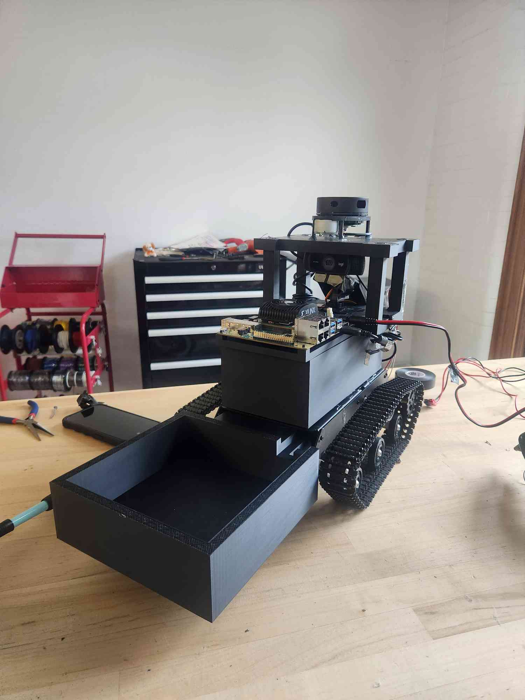

# Hamerschlag Haul

Autonomous indoor delivery robot built on a Raspberry Pi 5 with ROS2 Jazzy, Google Cartographer SLAM, Nav2 navigation, FPGA-accelerated person detection, and a behavioral safety protocol system. Designed for autonomous delivery in hallway environments.

---



## Hardware

| Component | Details |
|---|---|
| **Main computer** | Raspberry Pi 5 (8 GB) |
| **FPGA board** | AMD Kria KR260 |
| **LiDAR** | RPLiDAR A1M8 (USB) |
| **Odometry sensor** | SparkFun Qwiic OTOS (PAA5160E1, I2C) |
| **Motor driver** | Pololu VNH5019 dual motor driver |
| **Camera** | USB camera with pan-tilt servo mount |

**VNH5019 GPIO wiring (lgpio, gpiochip 4):**

| Side | INA | INB | PWM | CS |
|---|---|---|---|---|
| Left | 17 | 27 | 13 | 26 |
| Right | 22 | 23 | 12 | 16 |

PWM frequency: 1 kHz. Minimum duty cycle: 18% (below this the motors stall).

**SSH:** `ssh hhaul@yourip`
**Browser remote:** https://connect.raspberrypi.com

---

## Software Stack

| Layer | Version |
|---|---|
| OS | Ubuntu 24.04 LTS (Noble), 64-bit ARM |
| ROS2 | Jazzy Jalopy |
| Domain | `ROS_DOMAIN_ID=42` (set on Pi and Kria) |

### ROS2 package dependencies

```bash
sudo apt install \
  ros-jazzy-desktop \
  ros-jazzy-cartographer \
  ros-jazzy-cartographer-ros \
  ros-jazzy-nav2-bringup \
  ros-jazzy-nav2-amcl \
  ros-jazzy-nav2-map-server \
  ros-jazzy-nav2-lifecycle-manager \
  ros-jazzy-nav2-controller \
  ros-jazzy-nav2-planner \
  ros-jazzy-nav2-costmap-2d \
  ros-jazzy-nav2-bt-navigator \
  ros-jazzy-nav2-waypoint-follower \
  ros-jazzy-nav2-smoother \
  ros-jazzy-rplidar-ros \
  ros-jazzy-robot-state-publisher \
  ros-jazzy-tf2-ros \
  ros-jazzy-tf2-tools \
  ros-jazzy-rviz2 \
  ros-jazzy-twist-mux \
  ros-jazzy-teleop-twist-keyboard
```

### Python dependencies

```bash
pip install sparkfun-qwiic-otos --break-system-packages
pip install flask --break-system-packages
pip install lgpio --break-system-packages
sudo apt install python3-gpiozero python3-lgpio espeak
```

### `~/.bashrc` additions

```bash
source /opt/ros/jazzy/setup.bash
source ~/ros2_ws/install/setup.bash
export ROS_DOMAIN_ID=42
```

---

## Workspace Layout

```
~/ros2_ws/src/hamerschlag_haul/
├── config/
│   ├── rplidar_a1.lua               # Cartographer 2D SLAM (mapping)
│   ├── rplidar_a1_localization.lua  # Cartographer (localization)
│   └── nav2_params.yaml             # Nav2 full stack parameters
├── launch/
│   ├── master_launch.py             # Full system: Cartographer localization + Nav2
│   └── nav2_launch.py               # Nav2 only (external localization)
├── urdf/
│   └── robot.urdf                   # Robot description
├── otos_odom.py                     # SparkFun OTOS → /odom + TF
├── vnh5019_motor_run.py             # /cmd_vel → VNH5019 GPIO PWM
├── det_bridge.py                    # TCP socket → /person_detections
├── dispatch_server.py               # Flask REST API + Nav2 navigator
├── pan_tilt.py                      # LiDAR motion → servo pan tracker
├── laser_tf_broadcst.py             # Static TF: base_link → laser_frame
├── forward_stop.py                  # Scripted drive sequence for mapping
├── otos_calibrate.py                # Interactive OTOS scalar calibration
├── straight_calibration.py          # Forward/reverse motor test
└── spin_calibration.py              # Angular scalar calibration

Map files (saved to home directory):
~/map_new.pbstream   # Cartographer state (localization source)
~/map_new.pgm        # Occupancy grid (Nav2 map server)
~/map_new.yaml       # Map metadata
```

---

## TF Tree

```
map
└── odom             (published by Cartographer)
    └── base_link    (published by otos_odom.py)
        └── laser_frame  (static, via robot_state_publisher)
```

**Critical configuration notes:**

- `published_frame = "odom"` in the Cartographer `.lua` files — never `"base_link"` or it conflicts with the OTOS TF broadcast
- `ignore_timestamp: True` in `robot_state_publisher` parameters — prevents stale joint state timestamps from breaking TF lookups
- OTOS odometry must use **BEST_EFFORT QoS** — `RELIABLE` causes Cartographer to silently drop messages

---

## System Architecture

```
┌──────────────────────────────────────────────────────┐
│              Dispatch & Mission Control              │
│  dispatch_server.py — Flask REST API :5000           │
│  POST /dispatch {"destination":"A"} → Nav2 goal      │
└──────────────────────┬───────────────────────────────┘
                       │ nav2_simple_commander
                       v
┌──────────────────────────────────────────────────────┐
│                Nav2 Navigation Stack                 │
│  BT Navigator + DWB Local Planner                    │
│  max_vel_x=0.15 m/s   max_vel_θ=0.50 rad/s           │
└──────────────────────┬───────────────────────────────┘
                       │ /cmd_vel_nav
                       v
                velocity_smoother
                       │ /cmd_vel
                       v
┌──────────────────────────────────────────────────────┐
│              vnh5019_motor_run.py                    │
│  Differential-drive kinematics → PWM @ 1 kHz        │
│  Watchdog: stops if no cmd_vel for 0.5 s             │
└───────────────┬──────────────────────────────────────┘
           LEFT / RIGHT VNH5019 motors

┌──────────────────────────────────────────────────────┐
│                    Localization                      │
│  RPLiDAR A1M8 → /scan                                │
│  Cartographer (localization from map_new.pbstream)   │
│  OTOS → otos_odom.py → /odom + odom→base_link TF    │
│  (yaw covariance=99 forces scan-match heading)       │
└──────────────────────────────────────────────────────┘

┌──────────────────────────────────────────────────────┐
│                     Perception                       │
│  Kria KR260 :5555 → det_bridge.py                    │
│    Alarms via espeak (fallen / running person)       │
│  RPLiDAR /scan → pan_tilt.py                         │
│    Servo snaps to nearest cardinal direction         │
└──────────────────────────────────────────────────────┘
```

---

## ROS2 Nodes

### `otos_odom.py`
Reads the SparkFun OTOS over I2C and publishes `/odom` + the `odom→base_link` TF at 20 Hz.

The OTOS reports Y as forward and X as rightward in its native frame. This node remaps to standard ROS convention: `x_ros = pos.y`, `y_ros = -pos.x`. Yaw covariance is set to 99.0 deliberately — this tells Cartographer to discard OTOS heading and rely on LiDAR scan matching instead.

Uses a tight `while` loop (not a ROS timer) for maximum TF timestamp continuity. QoS must be `BEST_EFFORT`.

**Mounting requirement:** The OTOS must be mounted rigidly and flat on the chassis. Any tilt or vibration registers as robot movement and corrupts Cartographer's pose estimate. Handheld testing is not useful for SLAM validation.

### `vnh5019_motor_run.py`
Subscribes to `/cmd_vel` and drives both VNH5019 H-bridge channels via lgpio. Implements differential-drive kinematics:

```
lin_norm = linear.x / max_linear   (max_linear=0.5 m/s)
ang_norm = angular.z / max_angular  (max_angular=3.5 rad/s)
left  = lin_norm - ang_norm
right = lin_norm + ang_norm
```

Applies a 15% right-side trim to compensate for motor mismatch. Enforces 18% minimum duty cycle below which motors stall. A 0.5 s watchdog stops the motors if no `/cmd_vel` arrives.

### `det_bridge.py`
TCP server on port 5555. Receives newline-delimited JSON frames from the Kria KR260 and publishes to `/person_detections`. Issues `espeak` audio alarms:

- **Fallen person** — fires immediately on `laying_down=true` (5 s cooldown)
- **Running person** — fires after 6 consecutive frames with `running=true` (5 s cooldown, streak resets on clear frame)

Detection fields per object: `confidence`, `aspect_ratio`, `velocity_px_per_s`, `laying_down`, `running`.

**Start order:** Pi listener must be running before the Kria starts sending.

### `dispatch_server.py`
Flask server (port 5000) that translates REST commands into Nav2 goals via `nav2_simple_commander.BasicNavigator`. Navigation runs in a background thread; Flask routes are fully thread-safe.

The server returns `503` until Nav2's `bt_navigator` lifecycle node is active (~10 s after launch).

**Endpoints:**

| Method | Path | Body | Description |
|---|---|---|---|
| `GET` | `/status` | — | `{"state": "idle"\|"starting"\|"navigating"\|"failed", "destination": str\|null}` |
| `POST` | `/dispatch` | `{"destination":"A"}` | Navigate to waypoint A–D → 202 |
| `POST` | `/return` | — | Return to home (0, 0) → 202 |
| `GET` | `/map` | — | Raw PGM image of current map |

**Waypoints** — edit in [dispatch_server.py:62](dispatch_server.py#L62):

| Label | x (m) | y (m) | Heading |
|---|---|---|---|
| A | 1.00 | 0.50 | 0° |
| B | 2.50 | 1.00 | 90° |
| C | 2.50 | -1.00 | -90° |
| D | 0.50 | -1.50 | 180° |
| home | 0.00 | 0.00 | 0° |

To find real coordinates: launch `master_launch.py`, open RViz2, drive the robot to each delivery spot, read (x, y) from `/odom` or the RViz2 "Publish Point" tool.

### `pan_tilt.py`
Subscribes to `/scan` and compares consecutive scans. If more than 15 rays change by >0.3 m, the servo snaps to one of four cardinal orientations (left, center, right in current implementation — full N/E/S/W planned per [plan.txt](plan.txt)). Auto-detaches 0.6 s after each move to save power. Minimum 2 s between consecutive moves.

### `forward_stop.py`
Publishes a scripted Twist sequence (forward → turn left → stop) useful for building a map of a new space without manual driving.

---

## Google Cartographer SLAM

### Key config (`rplidar_a1.lua`)

```lua
options = {
  map_frame = "map",
  tracking_frame = "base_link",
  published_frame = "odom",       -- MUST be "odom" when use_odometry = true
  odom_frame = "odom",
  provide_odom_frame = false,     -- false when OTOS provides odom
  publish_frame_projected_to_2d = true,
  use_odometry = true,
  num_laser_scans = 1,
}

TRAJECTORY_BUILDER_2D.min_range = 0.1
TRAJECTORY_BUILDER_2D.max_range = 8.0
TRAJECTORY_BUILDER_2D.use_imu_data = false
TRAJECTORY_BUILDER_2D.use_online_correlative_scan_matching = true

-- Tuned values (see plan.txt):
POSE_GRAPH.optimize_every_n_nodes = 20
POSE_GRAPH.constraint_builder.min_score = 0.62
POSE_GRAPH.constraint_builder.global_localization_min_score = 0.68
POSE_GRAPH.constraint_builder.max_constraint_distance = 4.0
```

### Mapping workflow (run once to build the map)

```bash
# Terminal 1 — OTOS odometry
python3 ~/ros2_ws/src/hamerschlag_haul/otos_odom.py

# Terminal 2 — LiDAR
ros2 launch rplidar_ros rplidar_a1_launch.py

# Terminal 3 — SLAM in mapping mode
ros2 launch ~/ros2_ws/src/hamerschlag_haul/launch/cart_launch.py

# Terminal 4 — visualize
rviz2
```

Drive the robot through the full environment. When satisfied:

```bash
ros2 service call /finish_trajectory cartographer_ros_msgs/srv/FinishTrajectory "{trajectory_id: 0}"
ros2 service call /write_state cartographer_ros_msgs/srv/WriteState "{filename: '/home/hhaul/map_new.pbstream'}"
ros2 run nav2_map_server map_saver_cli -f ~/map_new
```

Verify:

```bash
ls ~/map_new*
# map_new.pbstream  map_new.pgm  map_new.yaml
```

**LiDAR mounting height:** 15–20 cm above the floor. Too low picks up under furniture; too high misses floor-level obstacles.

---

## SparkFun OTOS

Sensor: SparkFun Qwiic Optical Tracking Odometry Sensor (PAA5160E1), I2C.

```bash
# Verify I2C detection
sudo apt install i2c-tools
i2cdetect -y 1   # try bus 0 or 4 if bus 1 shows nothing on Pi 5

# Standalone test
git clone https://github.com/sparkfun/Qwiic_OTOS_Py.git
python3 Qwiic_OTOS_Py/examples/ex1_basic_readings.py
```

---

## RPLiDAR A1M8

Interface: USB (`/dev/ttyUSB0`), package `ros-jazzy-rplidar-ros`.

```bash
ros2 launch rplidar_ros rplidar_a1_launch.py
ros2 topic hz /scan      # verify it's publishing
ls /dev/ttyUSB*          # confirm port
```

---

## Calibration

Run these before deploying to a new environment or after mechanical changes.

**OTOS linear and angular scalars:**

```bash
python3 ~/ros2_ws/src/hamerschlag_haul/otos_calibrate.py
```

Follow the prompts (push robot 1 m forward, then rotate 360°). Copy the output scalars into `otos_odom.py` (`setLinearScalar` / `setAngularScalar`).

**Angular calibration via spinning:**

```bash
python3 ~/ros2_ws/src/hamerschlag_haul/spin_calibration.py
```

**Motor straight-line verification:**

```bash
python3 ~/ros2_ws/src/hamerschlag_haul/straight_calibration.py
```

Drives forward then backward for 15 s each. Adjust `right_trim` in `vnh5019_motor_run.py` if the robot pulls to one side (default: 15%).

---

## Running the Robot

**1. Build:**

```bash
cd ~/ros2_ws
colcon build --packages-select hamerschlag_haul
source install/setup.bash
```

**2. Full navigation stack:**

```bash
ros2 launch hamerschlag_haul master_launch.py
```

Wait ~10 s for the Nav2 lifecycle manager to activate all nodes.

**3. Motor control and odometry (separate terminals):**

```bash
ros2 run hamerschlag_haul vnh5019_motor_run
python3 ~/ros2_ws/src/hamerschlag_haul/otos_odom.py
```

**4. Dispatch server:**

```bash
python3 ~/ros2_ws/src/hamerschlag_haul/dispatch_server.py
```

**5. Person detection bridge:**

```bash
python3 ~/ros2_ws/src/hamerschlag_haul/det_bridge.py
# Then start the Kria sender after this is listening
```

**6. Send delivery commands:**

```bash
# Dispatch to a waypoint
curl -X POST http://yourip:5000/dispatch \
  -H "Content-Type: application/json" \
  -d '{"destination":"A"}'

# Check status
curl http://yourip:5000/status

# Return home
curl -X POST http://yourip:5000/return
```

### Common diagnostic checks

```bash
ros2 topic list
ros2 topic hz /scan
ros2 topic hz /odom
ros2 topic hz /person_detections
ros2 node list | grep nav2
ros2 topic list | grep costmap
ros2 run tf2_tools view_frames
```

---

## FPGA — AMD Kria KR260

Runs YOLOX-Nano person detection via Vitis AI DPU B4096. Sends results to the Pi over TCP.

**Detection pipeline:**

```
USB Camera → GStreamer → YOLOX-Nano INT8 (DPU B4096)
  → score threshold filter (person class only)
  → greedy NMS (IoU threshold 0.45, HLS fixed-point)
  → TCP socket → Pi :5555 → det_bridge.py
```

**Detection JSON format (one object per line):**

```json
{
  "detections": [
    {
      "confidence": 0.87,
      "aspect_ratio": 0.45,
      "velocity_px_per_s": 12.3,
      "laying_down": false,
      "running": false
    }
  ]
}
```

**Start on Kria (after Pi listener is running):**

```bash
python3 gst_normal_camera_yolox_test.py
```

---

## Networking

| | |
|---|---|
| Pi SSH | `ssh hhaul@172.26.19.241` |
| Pi browser remote | https://connect.raspberrypi.com |
| ROS_DOMAIN_ID | `42` (Pi and Kria both) |
| Detection socket | TCP port 5555, Kria → Pi |
| Dispatch API | TCP port 5000, Pi |

---
## Troubleshooting

**Map drifts or jumps**
- OTOS must be mounted rigidly — handheld testing is unusable for SLAM
- Confirm `published_frame = "odom"` in the Cartographer `.lua` (not `"base_link"`)
- Check for duplicate TF broadcasts: `ros2 run tf2_tools view_frames`
- LiDAR height: 15–20 cm off the floor

**TF lookup failures in Cartographer**
- `robot_state_publisher` must have `ignore_timestamp: True`
- OTOS node must be running and publishing `/odom` before Cartographer starts
- OTOS QoS must be `BEST_EFFORT`, not `RELIABLE`

**Nav2 costmaps not appearing in RViz2**
- Lifecycle manager takes ~10 s to activate after launch
- `ros2 node list | grep nav2` — check all nodes are up
- `ros2 topic list | grep costmap` — check topics exist

**Person detections not arriving on Pi**
- Start Pi's `det_bridge.py` before the Kria sender
- Confirm same `ROS_DOMAIN_ID=42` on both devices
- `netstat -tlnp | grep 5555` on Pi to confirm socket is listening

**apt failing on CMU network**
- `echo 'Acquire::ForceIPv4 "true";' | sudo tee /etc/apt/apt.conf.d/99force-ipv4`
